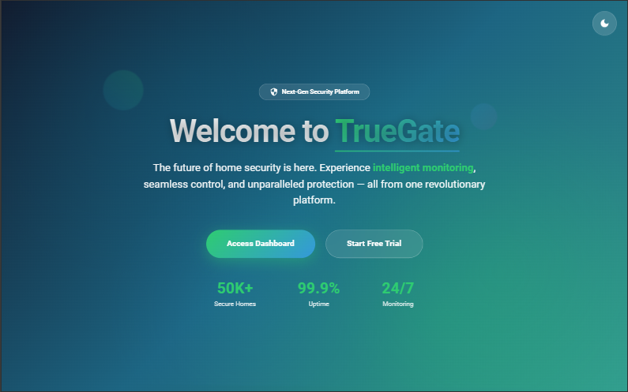

# TrueGate
> A secure, modern web platform for seamless user access.



---
## About the Project

TrueGate is a full-stack web application built to provide a secure, role-based platform with modern design principles. It features authentication, protected routes, and an intuitive user experience.

---

##  Features

-  Secure JWT-based login system
-  Role-based authorization (Admin/User)
-  Material UI design system
-  Responsive and accessible layout
-  Redux-based global state management
-  RESTful API architecture
-  Postman-tested endpoints

---

##  Tech Stack

**Frontend:**
- React
- Material UI
- React Router
- Redux

**Backend:**
- Node.js
- Express.js
- MongoDB
- Mongoose

**DevOps:**
- Git & GitHub
- Netlify (Frontend)
- Render (Backend)
- Postman (API Testing)

---

## 🛠 Getting Started

```bash
# Clone the repo
git clone https://github.com/your-username/truegate.git

# Navigate to backend
cd backend
npm install
npm run dev

# Navigate to frontend
cd ../frontend
npm install
npm start
```

---

## Environment Variables

In `/backend/.env`:

```env
PORT
JWT_SECRET
MONGODB_URI
MONGODB_DB
BREVO_API_KEY
BREVO_USER
CSRF_SECRET
```

---

##  Testing

-  Postman for API endpoint testing
-  Manual UI testing 

---

## 🌍 Deployment

- **Frontend:** [https://www.truegate.live](https://www.truegate.live)
- **Backend:** [https://api.truegate.live/api](https://api.truegate.live/api)
---

## 👥 Contributors

- Frontend Designer - <a href = "https://github.com/Tharuka621">Tharuka Mudunna</a>
- Devops Enginners - <a href = "https://github.com/shpeiris">Sandali Hiranya</a>
- Backend Developer - <a href = "https://github.com/budd9442">Buddhika Bandara</a>
- Frontend Developer - <a href = "https://github.com/akilapilapitiya">Akila Pilapitiya</a>
- Quality Assurance - <a href = "https://github.com/YonaliKavi">Yonali Kavindya</


---
